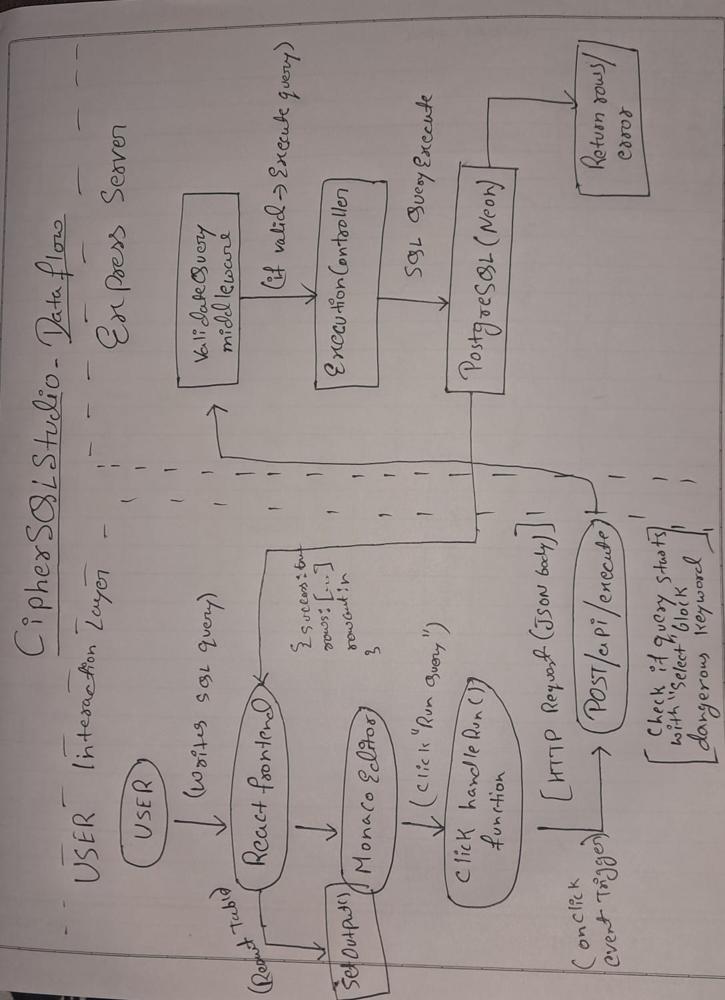
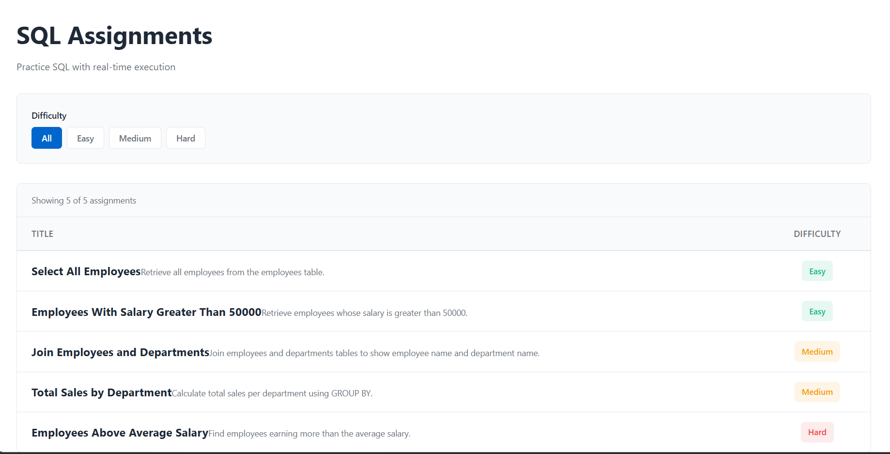
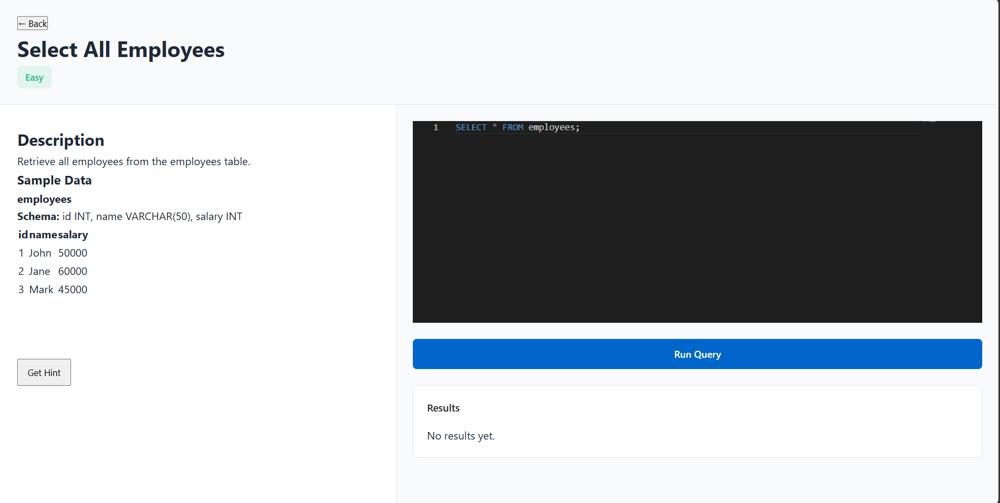
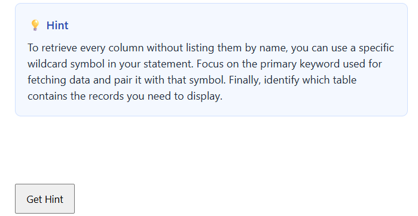

# CipherSQLStudio

CipherSQLStudio is a browser-based SQL learning platform where users can practice SQL queries against pre-configured assignments with real-time execution and intelligent LLM-powered hints.

The system focuses on secure execution, clear architecture, and guided learning — not automated solution generation.

---

##  Tech Stack

### Frontend
- React.js
- Monaco Editor
- Vanilla SCSS (Mobile-first, BEM methodology)

### Backend
- Node.js
- Express.js
- Middleware-based validation

### Databases
- PostgreSQL (Neon Cloud) – SQL execution engine
- MongoDB Atlas – Assignment metadata storage

### LLM Integration
- Google Gemini API (Hint generation only)

---

#  Architecture Overview

CipherSQLStudio follows a layered full-stack architecture with strict separation of responsibilities.

## Frontend (React)

Responsible for:
- Rendering assignment list
- Displaying schema and sample data
- Providing SQL editor (Monaco)
- Sending queries to backend
- Rendering results dynamically
- Requesting contextual hints

All UI updates are state-driven using React hooks.

---

## Backend (Express)

Acts as the orchestration layer between frontend and services.

Core responsibilities:
- Route handling
- Query validation middleware
- Secure SQL execution
- LLM prompt construction
- Response formatting

### Main Endpoints

- `GET /api/assignments`
- `POST /api/execute`
- `POST /api/hint`

---

## PostgreSQL (Neon Cloud)

Used strictly for SQL query execution.

- Tables are pre-configured by administrators
- Only SELECT queries are allowed
- Destructive queries are blocked via validation middleware

This ensures safe execution while preserving database integrity.

---

## MongoDB (Atlas)

Stores assignment metadata:

- Title
- Description
- Difficulty
- Table schemas
- Sample preview rows

MongoDB does not execute SQL queries.  
It acts purely as structured content storage.

---

## LLM Hint System (Google Gemini)

Hints are generated using controlled prompt engineering.

Safeguards implemented:
- Explicit instruction to avoid full solutions
- No code block responses
- Regex-based SQL keyword filtering
- Short conceptual guidance only

The goal is to assist learning without revealing answers.

---

#  Data Flow Diagram (DFD)



### Query Execution Flow

User → React → `POST /api/execute`  
→ Validation Middleware → PostgreSQL  
→ JSON Response → React State Update → Results Render

### Hint Flow

User → React → `POST /api/hint`  
→ Express → Gemini API  
→ Filtered Response → React State Update → Hint Display

---

# 📸 Screenshots

## Assignment Listing Page


## Assignment Attempt Interface


## Hint System


---

# 🔐 Security Considerations

- Only SELECT queries are permitted
- Destructive SQL commands are blocked
- Environment variables used for all secrets
- LLM restricted to hint-level responses
- Separation between execution DB and metadata DB

---

# ⚙️ Environment Variables

Create a `.env` file inside the backend folder:

```
 MONGO_URI=
 DATABASE_URL=
 GEMINI_API_KEY=
 PORT=5000

```

---

# ▶️ Installation & Setup

## 1️⃣ Clone Repository
```
 git clone [https://github.com/Ashish-Pandey0927/Cipher-SQL-Studio](https://github.com/Ashish-Pandey0927/Cipher-SQL-Studio)

 cd CipherSQLStudio

```


---

## 2️⃣ Backend Setup

```
cd backend
npm install
npm start

```

---

## 3️⃣ Frontend Setup

```
cd frontend
npm install
npm run dev

```

---

# 📌 Key Architectural Decisions

- Two-database architecture separates metadata from execution logic.
- Middleware-based validation ensures secure SQL handling.
- Cloud PostgreSQL simulates real-world deployment.
- Prompt engineering maintains educational integrity of the LLM.
- Mobile-first SCSS ensures responsive usability.

---

# 📦 Folder Structure (Simplified)

```
backend/
├─ controllers/
├─ examples/
├─ routes/
├─ middleware/
├─ config/
├─ models/

```
```
frontend/
├─components/
├─styles/

```

```
docs/
├─dfd1.jpeg
├─dfd2.jpeg
├─screenshot-assignments.png
├─screenshot-editor.png
├─screenshot-hint.png

```


---

# 🎯 Project Goals

- Provide a realistic SQL practice environment
- Maintain secure execution boundaries
- Deliver guided hints instead of direct answers
- Demonstrate clear full-stack architecture

---

# 🧠 Author

Ashish Pandey  
Full Stack Developer


